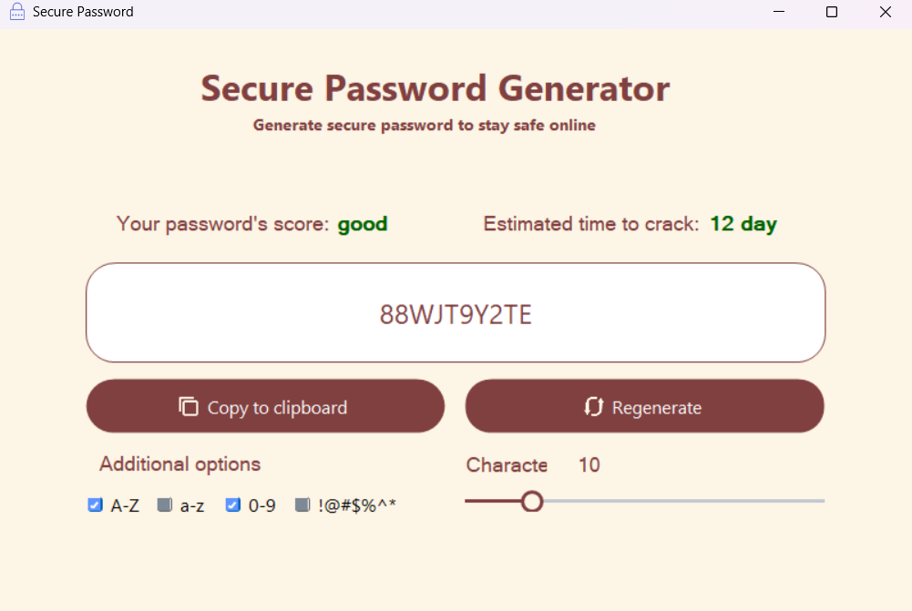
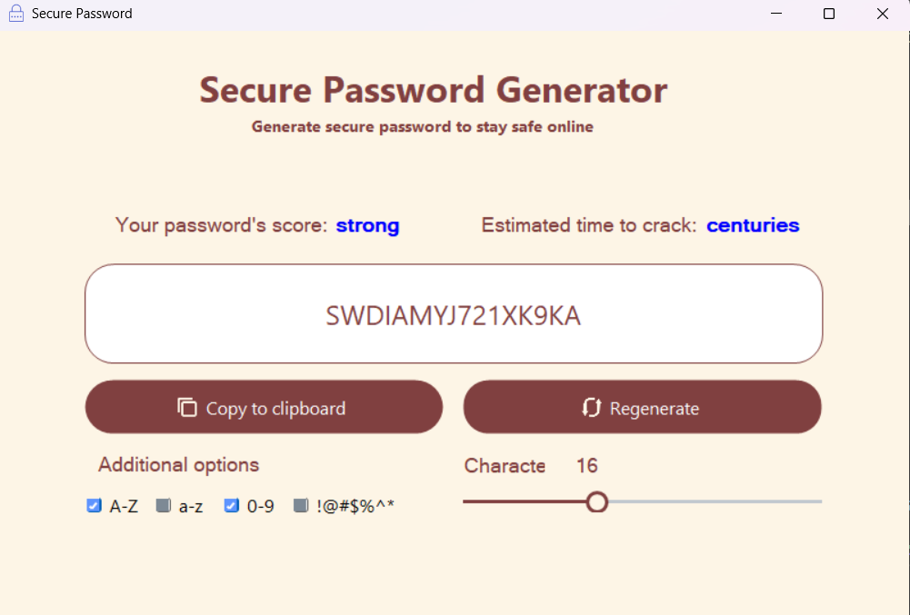
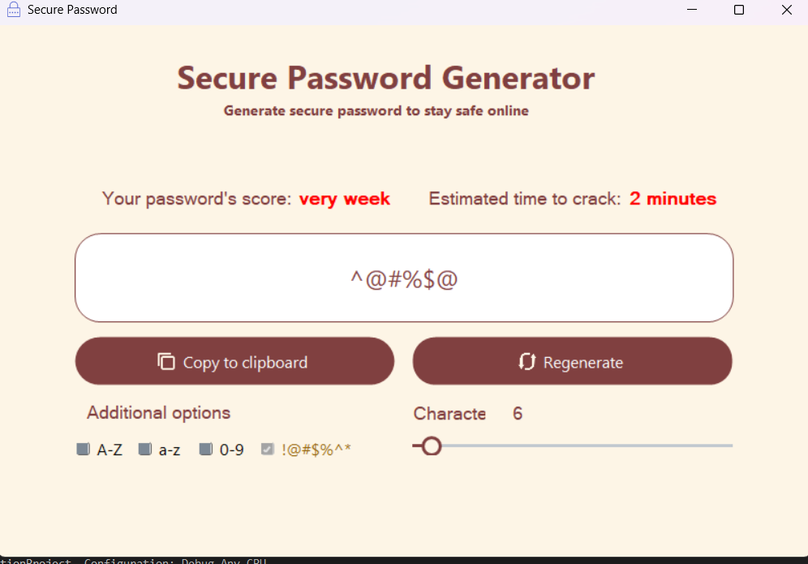

# Secure Password Generator 🔐

A simple Windows Forms application built with **C#** to generate secure random passwords.
 The app allows users to customize password length and character sets (uppercase, lowercase, digits, special characters) and provides an estimated "time to crack" score for the generated password.

------

## 🚀 Features

- Generate strong and random passwords instantly.
- Adjustable password length using a slider.
- Choose which character sets to include:
  - ✅ Uppercase letters (A–Z)
  - ✅ Lowercase letters (a–z)
  - ✅ Digits (0–9)
  - ✅ Special characters (!@#$%^&*)
- Displays password strength score (`very weak`, `weak`, `good`, `strong`).
- Estimates the cracking time of the generated password.
- Copy password to clipboard with a single click.
- Regenerate button to quickly create a new password.

------

## 📷 Preview

---

---

